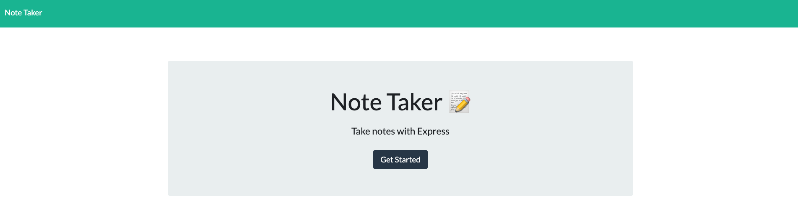
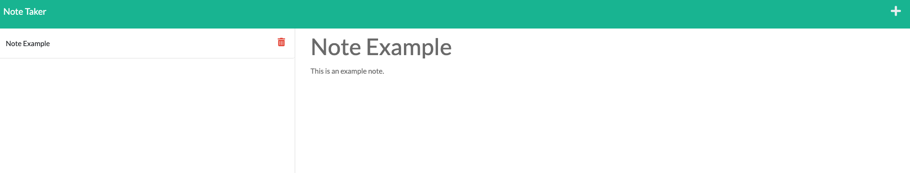

# NotePad

## Description
NotePad is an application built with `Node.Js` using `Express.Js` that enables users to write and save their notes for future reference.
## Table of Contents
- [Description](#description)
- [Demo](#demo)
- [License](#license)
- [Testing](#test)
- [Tech Stack](#technologies)
- [Feedback](#feedback)

 

## Demo

 - [Click to visit the page!](https://not-pad.herokuapp.com/)

### Home Screen:

 

### Note Example:

 

## Test

    – To test the app on your local machine follow the instructions:
        • Clone the repository
        • Ensure you are in the project directory
        • Run npm i or npm install to install the required packages
        • Run npm start and access http://localhost:3001 from your browser

## License
This project is licensed under the MIT License.
## Technologies

    – Libraries:
        • Express.Js
        • uuidv4

    – CI/CD:
        • GitHub
        • Heroku

## Feedback
GitHub: [github.com/rfabreu](https://github.com/rfabreu)  
Comments, suggestions, questions? Contact me at: [rafael.gomes@mail.utoronto.ca](mailto:rafael.gomes@mail.utoronto.ca)  
Link to deployed application: [Check it out!](https://not-pad.herokuapp.com/)

